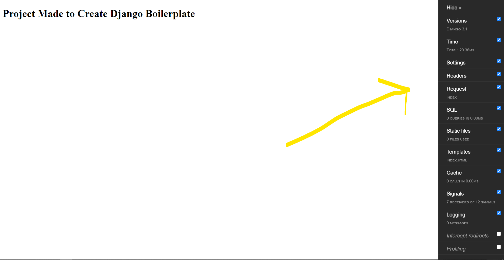

<h1> Python Django Boilerplate </h1>

Getting started
Steps:

1. Clone/pull/download this repository
2. Create a virtualenv with virtualenv env 
3. Install dependencies with pip install -r requirements.txt
4. Configure your .env variables
5. Rename your project with python manage.py rename <yourprojectname> <newprojectname>

Link of Django Debug Toolbar: https://django-debug-toolbar.readthedocs.io/en/latest/configuration.html

You can see debug configuration and settings in settings.py folder.

*Some files are not uploaded due to security purpose. You can see .gitignore to see what are the files that are not uploaded

HAPPY CODING!